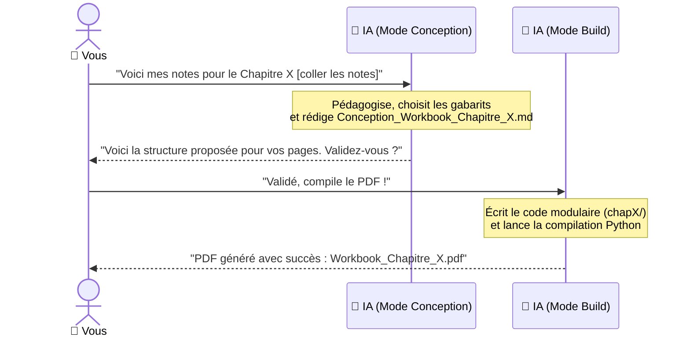

# Guide Prise de Notes & Workflow Livret (MDM Workbook)

Ce guide est votre notice de référence. Il explique comment transformer vos notes de séance brutes en un livret PDF pédagogique impeccable, sans friction et garanti sans débordement graphique.

---

## 1. La Philosophie : "Penser en Pages"

Un livret d'accompagnement ou de bilan de compétences ne se lit pas comme un roman : il se vit page par page.
* **1 Page = 1 Intention claire** (ex : poser le cadre, faire le point sur son énergie, trier ses priorités, ancrer un engagement).
* **Moins de blabla, plus de recul** : les consignes courtes et percutantes sont toujours plus efficaces pour le bénéficiaire que de longs paragraphes.
* **L'espace d'écriture appartient au bénéficiaire** : les zones interactives (AcroForm) sont automatiquement dimensionnées par le moteur pour offrir un espace de réponse confortable.

---

## 2. Le Catalogue des 10 Gabarits Disponibles

L'agent IA dispose de 10 gabarits universels testés et incassables :

| N° | Gabarit | Rôle Pédagogique | Éléments Visuels |
|:---|:---|:---|:---|
| **1** | **Couverture** | Accueil & Identité | Titre principal, sous-titre de chapitre, illustration ou cercle zen, tampon rouge |
| **2** | **Sommaire & Concept** | Vision d'ensemble | Grand numéro en filigrane sur fond indigo, titre fort, citation/intro, liste des étapes |
| **3** | **Questions Auto-Fit** | Réflexion guidée (1 à 4 questions) | Intitulés de questions colorés, sous-titres discrets, encadrés d'exemples gris ombrés, champs de réponse ajustés dynamiquement |
| **4** | **Météo Intérieure** | Ice-breaker / Climat de séance | Choix météo (Soleil, Nuage, Pluie, Orage), curseur d'énergie 0 à 10, champ de réflexion libre |
| **5** | **4 Quadrants / Matrice** | Vision 360°, SWOT, Piliers | Radar vectoriel central, 4 quadrants symétriques avec badges "pill" et champs de synthèse |
| **6** | **2 Colonnes Miroir** | Comparatif, Frein $\rightarrow$ Levier | Table comparative à double colonne avec flèches relationnelles au centre (Avant/Après, Épreuve/Talent) |
| **7** | **Enquête Réseau & Métier** | Customer Discovery, Interview terrain | Carte de contact (nom, rôle, entreprise, date) + 3 axes d'investigation qualitative (Besoins, Solutions actuelles, Pépites) |
| **8** | **Feuille de Route 30·60·90** | Plan d'action chronologique & Paliers | 3 Paliers d'action empilés avec objectifs prioritaires, cases à cocher et indicateurs de succès (KPI) |
| **9** | **Engagement & Signature** | Contrat moral / Bilan | Puces d'engagement personnalisées, date et champ de signature interactive |
| **10** | **Clôture** | Ancrage & Félicitations | Logo centré, phrases d'encouragement et invitation à la prochaine étape |

---

## 2. bis. Le Système de Composition Libre (Atomic Design)

En plus des 10 gabarits prédéfinis, vous pouvez créer des **pages sur-mesure (`composite`)** en assemblant librement des briques atomiques modulaires :

| Composant Atomique | Rôle & Usage | Paramètres Clés |
|:---|:---|:---|
| **`callout`** | Encadré citation, repère ou conseil clé | `text`, `title`, `variant` ('info' bleu, 'tip' rouge, 'quote' vert) |
| **`cards_grid`** | Grille de 2 ou 3 cartes d'analyse avec AcroForm | `cards` (titre, sous-titre, placeholder), `columns` (2 ou 3), `card_height_cm` |
| **`scale`** | Jauge / curseur d'évaluation 0 à 10 | `label`, `min_val`, `max_val`, `min_label`, `max_label` |
| **`checklist`** | Liste de critères ou tâches à cocher | `items` (libellés), `title`, `columns` (1 ou 2) |
| **`table`** | Tableau structuré de suivi d'actions | `headers`, `rows` (cellules de texte ou inputs de saisie) |
| **`stat_boxes`** | Rangée de 2 à 4 chiffres ou KPI phares | `stats` (`stat` en grand chiffre + `label` en sous-titre) |
| **`question`** | Question ouverte avec zone de réponse | `question`, `subtitle`, `example`, `box_height_cm` |

> [!IMPORTANT]
> **Règle d'or de respiration visuelle : 2 à 3 composants maximum par page.**  
> Pour préserver l'élégance épurée et zen de Marge de Manœuvre, ne cherchez jamais à entasser 4 ou 5 composants sur une même feuille A4. Une page aérée avec de l'espace blanc et de grandes boîtes d'écriture est infiniment plus engageante et percutante pour le bénéficiaire.

---

## 3. Ce que vous écrivez (Le Format de Notes Idéal)

Vous n'avez pas besoin d'écrire du code ni de calculer des marges. Donnez simplement vos notes brutes à l'agent sous forme de bullet points avec vos intentions.

### Exemple de note brute type :

```markdown
Thème : Chapitre 4 - Clarifier mes Valeurs & Poser mes Limites
Thème couleur souhaité : indigo (ou earth)

Intentions de séance :
- Page 1 : Météo de départ (jauge énergie + humeur).
- Page 2 : Intro / Concept. Expliquer pourquoi clarifier ses valeurs permet d'éviter l'épuisement au travail.
- Page 3 : Exercice 4 Quadrants. Les 4 piliers de vie : Professionnel, Personnel, Social, Cadre/Liberté.
- Page 4 : Exercice Réflexion. 3 questions sur les situations où l'on a du mal à dire non.
- Page 5 : Exercice Miroir 2 colonnes. Croyance limitante (colonne 1) vers Croyance ressource (colonne 2).
- Page 6 : Mon engagement pour les 15 prochains jours + signature.
```

---

## 4. Budgets Indicatifs de Texte (Pour l'esprit de synthèse)

Pour un rendu aéré et professionnel, voici les repères recommandés :

* **Titre de page** : max 40 caractères (1 ligne).
* **Sous-titre / Consigne introductive** : 150 à 250 caractères (2 à 3 lignes).
* **Intitulé de question** : max 120 caractères (1 à 2 lignes).
* **Exemple d'illustration** : max 100 caractères (1 ligne précédée de `Ex :`).
* **Quadrants (titre d'axe)** : 2 à 4 mots (ex : *Professionnel*, *Santé & Énergie*).

---

## 5. Le Workflow en 2 Étapes IA



### Comment invoquer l'agent ?

1. **Phase 1 : Conception**
   > *"Voici mes notes pour le Chapitre [X] : [coller les notes]. Lance le mode conception du skill workbook-generator et prépare le fichier de conception."*

2. **Validation / Ajustement**
   > *"C'est validé, compile le chapitre !"*  
   > *(Ou : "Sur la page 3, remplace le terme X par Y puis compile.")*

3. **Phase 2 : Compilation**
   L'agent crée le sous-dossier `Scripts/workbook_generator/chapters/chapX/`, configure `main_generate_chapX.py`, lance la commande et vérifie qu'aucun warning n'apparaît.

---

## 6. Questions Fréquentes (FAQ)

### Que faire si je veux modifier un texte dans un chapitre déjà généré ?
Dites simplement à l'agent :  
> *"Dans le Chapitre 3, modifie la question 1 pour demander [...] et recompile."*  
L'agent cible directement le fichier concerné. Le moteur Auto-Fit recalculera automatiquement la hauteur des boîtes pour que rien ne déborde.

### Comment tester un autre thème de couleur ?
Vous pouvez générer n'importe quel chapitre dans le thème Terracotta / Terre naturelle (`earth`) au lieu du thème bleu moderne (`indigo`) :
```bash
python Scripts/main_generate_chap1.py --theme earth
```

### Que faire si j'ai besoin d'un gabarit qui n'existe pas encore ?
Demandez à l'agent d'ajouter le composant dans la bibliothèque :  
> *"J'ai besoin d'un nouveau gabarit [Roue de la vie / Tableau d'actions 3 colonnes]. Ajoute-le dans components.py et montre-moi le test."*  
Le composant sera codé dans le Design System et rejoindra immédiatement la boîte à outils universelle.
