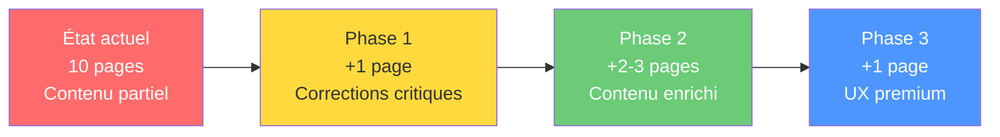

# Audit Pédagogique — Workbook Chapitre 4
## « Valeurs, Moteurs et Relation à l'Argent »

Analyse croisée du PDF généré ([Workbook_Chapitre_4.pdf](file:///c:/Users/nblum/LLM_LAB/PROJETS/workbook-mdm/Workbook_Chapitre_4.pdf)) et du code source ([chap4.py](file:///c:/Users/nblum/LLM_LAB/PROJETS/workbook-mdm/Scripts/workbook_generator/chapters/chap4.py)), en comparaison avec le cahier de conception ([Conception_Workbook_Chapitre_4.md](file:///c:/Users/nblum/LLM_LAB/PROJETS/workbook-mdm/Wordbook/Chapter%204/Conception_Workbook_Chapitre_4.md)) et les 11 fichiers d'exercices du dossier `Wordbook/Chapter 4/`.

---

## 1. SYNTHÈSE EXÉCUTIVE

| Dimension | Verdict | Commentaire |
|---|---|---|
| **Structure & séquence** | 🟡 Correct | Le flow existe mais manque de transitions explicites entre blocs |
| **Fidélité à la conception** | 🔴 Lacunes | Page Mindset de Surplus (`create_mindset_surplus_page`) = `pass` (non implémentée) |
| **Richesse du contenu** | 🟡 Partielle | Les exercices sources sont beaucoup plus riches que ce qui est rendu dans le PDF |
| **Ingénierie pédagogique** | 🔴 Faible | Absence de scaffolding, d'exemples guidés, de grilles de scoring, de consignes processuelles |
| **Expérience utilisateur** | 🟡 Fonctionnelle | Le layout fonctionne mais manque de variété visuelle et d'affordances |
| **Code technique** | 🟡 Hétérogène | `create_psycho_edu_page` contourne le système `PageLayout` contrairement aux autres |

---

## 2. CE QUI EST BIEN ✅

### 2.1 Architecture pédagogique globale
- **Séquence logique cohérente** : Récap MBTI → Valeurs → Psycho Financière → Biographie → Lettre → Archétypes → Synthèse → Exploration. C'est un excellent funnel introspectif du cognitif vers l'émotionnel puis le projectif.
- **Lien inter-chapitres** : Le récap MBTI (S3) crée un pont mnésique efficace. La cartographie synthétise S1-S4.
- **Progressivité du risque émotionnel** : Valeurs (sécurisant) → KMSI (diagnostic) → Biographie (vulnérabilité) → Lettre (expression). C'est bien gradué.

### 2.2 Contenus spécifiques forts
- **KMSI** : Bonne implémentation de l'échelle de Likert (1-6) avec checkboxes interactives, fidèle au protocole de Klontz.
- **Lettre à l'Argent** : L'exercice narratif est bien structuré (Salutation → État des lieux → Reproche → Demande → Insight → Nouvelle Alliance). Très cohérent avec la pratique narrative.
- **Cartographie Personnelle** : Bonne synthèse à 4 quadrants (Profil / Moteurs / Besoins / Objectifs + Feedback).
- **Questions du Récap** bien formulées : ouvertes, orientées prise de conscience, non-jugeantes.

### 2.3 Technique
- Utilisation cohérente du système `PageLayout` / `QuestionConfig` / `TextConfig` pour la majorité des pages.
- Alternance de couleurs bleu/rouge pour le rythme visuel des questions.
- Les `form_field_id` sont bien nommés et uniques (important pour l'extraction de données).

---

## 3. CE QUI EST SUBOPTIMAL 🟡

### 3.1 Contenu tronqué vs. Source

> [!WARNING]
> Écart significatif entre la richesse des exercices sources et le rendu PDF.

| Exercice | Source (Markdown) | PDF (chap4.py) | Perte |
|---|---|---|---|
| **KMSI** | 4 sections + Analyse des Impacts par dominante + exemple de reformulation HMW | 4 sections + bilan minimal + HMW sans exemple | **Analyse des impacts (L40-43 du .md) totalement absente** — c'est la partie la plus utile pour le bénéficiaire |
| **Biographie** | 3 étapes + 2 exemples concrets (père/notes) | 3 étapes, **0 exemple** | L'absence d'exemples freine l'engagement dans un exercice à haute charge émotionnelle |
| **Archétypes** | 8 archétypes avec Forces/Ombres détaillées + Plans d'Action par profil (4 exemples) | 8 archétypes en liste condensée (1 ligne chaque, police 9pt) + aucun plan spécifique | La liste est trop dense et illisible ; les plans d'action personnalisés manquent |
| **Valeurs Schwarz** | Identification + Héritage + Conflits + question "valeurs qui s'affrontent aujourd'hui" | Identification + Héritage + Conflits + Bilan | Question manquante : "Y a-t-il des valeurs qui s'affrontent en moi **actuellement** ?" |
| **Verbes d'Action** | Liste catégorisée (Organiser/Communiquer/Créer/Aider/Analyser/Diriger) + lien RIASEC/MBTI | Question générique sans liste de référence + lien "expériences passées et profil MBTI" | **La liste de référence des verbes est absente** — comment le bénéficiaire peut-il choisir sans support ? |
| **Mindset Surplus** | Grille Scarcity vs Surplus (4 domaines) + 3 actions de générosité + Question de projection | **`pass`** — Page non implémentée | **100% du contenu manquant** |

### 3.2 Ingénierie pédagogique

#### A. Absence de scaffolding (étayage)
Les questions sont posées "brutes" sans guidage progressif :
- **Valeurs** : "Illustrez vos 3 valeurs par un exemple" → mais aucune liste de valeurs de Schwarz n'est fournie dans le workbook ! Le bénéficiaire est supposé les connaître.
- **Biographie** : Questions profondes sans exemple de réponse attendue. Les exemples du .md source (père/notes) sont des amorces essentielles qui facilitent l'accès au souvenir.
- **Archétypes** : Les descriptions en police 9pt sur 2 colonnes sont une surcharge cognitive. L'exercice demande d'identifier un Top 3 mais ne donne pas de critère de choix.

#### B. Absence de consignes processuelles
- Aucune indication de **temps estimé** par exercice (ex: "~10 min").
- Aucune indication de **posture** (ex: "Installez-vous au calme", "Fermez les yeux un instant").
- Pas de **permission émotionnelle** (ex: "Il est normal de ressentir de l'inconfort").

#### C. Absence de liens entre exercices
- Le KMSI identifie un script dominant → mais la Biographie ne fait pas référence au script identifié.
- Les Valeurs identifient des moteurs → mais la Lettre à l'Argent ne demande pas de vérifier si le rapport à l'argent entre en conflit avec ces valeurs.
- L'Archétype identifié → n'est pas relié au Money Script pour une vue intégrée.

#### D. Pas de synthèse intermédiaire
- Après le bloc Psycho-Financier (KMSI + Biographie + Lettre + Archétypes), il manque une page de **synthèse relationnelle** avant la Cartographie. Le passage est abrupt.

### 3.3 Page Psycho-Éducation

> [!IMPORTANT]
> La page `create_psycho_edu_page` est un bloc de texte pur de 25 lignes sans aucune interaction — c'est un mur de texte.

Problèmes :
1. **Pas de PageLayout** : Cette page utilise du code brut (`draw_page_background`, `draw_title`, boucle `for line in lines`) au lieu du système `PageLayout`. C'est incohérent avec le reste du chapitre et difficile à maintenir.
2. **Pas d'interaction** : Le contenu théorique serait bien meilleur avec des mini-activités intégrées (ex: "Avant de lire la suite, essayez de deviner votre profil dominant").
3. **Contenu plus riche dans les sources** : `Psycho_Education_Financiere.md` contient des liens avec la négociation salariale, les "Financial Flashpoints", le concept "Net Worth = Self Worth" — tout ça est perdu.

### 3.4 Espace de réponse inadapté

| Exercice | Espace alloué | Évaluation |
|---|---|---|
| Lettre à l'Argent | 10 cm | ✅ Correct pour un exercice narratif |
| Biographie Premier Souvenir | 4.5 cm | 🟡 Juste pour un souvenir détaillé avec contexte |
| Verbes préférés | 6 cm | 🔴 Trop grand pour une simple liste de verbes |
| Analyse verbes | 6 cm | 🔴 Trop grand proportionnellement |
| Bilan valeurs | 4.5 cm | ✅ Correct |
| Top 3 Archétypes | 2.5 cm | 🔴 Trop petit si on attend une justification |
| Plan d'Action Archétypes | 6 cm | ✅ Correct |
| Pistes exploration | 5 cm × 3 | 🟡 Les 3 pistes identiques ne guident pas assez |

---

## 4. CE QUI EST À CORRIGER 🔴

### 4.1 `create_mindset_surplus_page` non implémentée

```python
def create_mindset_surplus_page(c):
    pass  # ← Ligne 337
```

C'est le **point 6 du sommaire** ("Mon Archétype Sacré & Mindset de Surplus"). La page est listée dans le sommaire mais génère une page blanche. Le contenu source (`Exercice_Mindset_Surplus.md`) est riche : grille diagnostic Scarcity vs Surplus, 3 actions de générosité stratégique, question de projection.

### 4.2 Absence de la liste de valeurs de Schwarz

L'exercice Valeurs demande "À partir de la liste de valeurs de Schwarz" mais **aucune liste n'est présentée dans le workbook**. Le bénéficiaire ne peut pas faire l'exercice de manière autonome.

### 4.3 Absence de la grille de scoring KMSI

Le KMSI demande de "Calculer votre score pour chaque catégorie" mais :
- Pas de grille de calcul fournie
- Pas de seuils d'interprétation
- Pas d'explication de ce que signifient les scores

### 4.4 Absence de la section "Analyse des Impacts" du KMSI

Les 4 paragraphes d'impact par dominante (L40-43 du source) sont absents :
- Dominante Évitement → risque sous-tarification
- Dominante Adoration → risque burnout
- Dominante Statut → risque dépenses de prestige
- Dominante Vigilance → risque paralysie d'investissement

C'est **la connexion directe avec le projet professionnel** — essentielle dans un bilan de compétences.

### 4.5 Incohérence technique `create_psycho_edu_page`

Cette page n'utilise pas `PageLayout` contrairement à toutes les autres pages du chapitre. Cela crée :
- Un risque de divergence visuelle (marges, espacement)
- Une difficulté de maintenance accrue
- Un `y_start` hardcodé (`height - 5.0 * cm`) au lieu du calcul automatique

---

## 5. PROPOSITIONS D'AMÉLIORATION

### Priorité 1 — Corrections critiques (Impact élevé, effort faible)

#### P1.1 — Implémenter `create_mindset_surplus_page`
- Grille comparative Scarcity vs Surplus (4 domaines : Ressources, Dépense, Don, Sécurité)
- 3 champs d'action de générosité stratégique
- Question de projection ("Si l'argent n'était plus un problème...")
- **Fichier** : [chap4.py L336-337](file:///c:/Users/nblum/LLM_LAB/PROJETS/workbook-mdm/Scripts/workbook_generator/chapters/chap4.py#L336-L337)

#### P1.2 — Ajouter la liste de valeurs de Schwarz
- Créer une page de référence avec les 10 valeurs universelles de Schwarz (Autonomie, Stimulation, Hédonisme, Réussite, Pouvoir, Sécurité, Conformité, Tradition, Bienveillance, Universalisme)
- Utiliser un layout en 2 colonnes ou un tableau compact
- **Fichier** : [chap4.py L47-79](file:///c:/Users/nblum/LLM_LAB/PROJETS/workbook-mdm/Scripts/workbook_generator/chapters/chap4.py#L47-L79) — ajouter une page avant ou intégrer au flux

#### P1.3 — Ajouter les analyses d'impact KMSI
- Insérer un bloc textuel après le bilan KMSI avec les 4 paragraphes d'impact pro
- Ou créer une page dédiée "Impact de mon Money Script sur mon Projet Pro"
- **Source** : [Exercice_Inventaire_Croyances.md L39-43](file:///c:/Users/nblum/LLM_LAB/PROJETS/workbook-mdm/Wordbook/Chapter%204/Exercice_Inventaire_Croyances.md#L39-L43)

#### P1.4 — Refactorer `create_psycho_edu_page` sur `PageLayout`
- Remplacer le code brut par un `PageLayout` avec `add_text()` pour cohérence
- **Fichier** : [chap4.py L112-164](file:///c:/Users/nblum/LLM_LAB/PROJETS/workbook-mdm/Scripts/workbook_generator/chapters/chap4.py#L112-L164)

---

### Priorité 2 — Enrichissements pédagogiques (Impact élevé, effort moyen)

#### P2.1 — Ajouter des exemples guidés à la Biographie
- Intégrer les 2 exemples du source (père critiquant une dépense / argent contre bonnes notes)
- Format : encadré gris clair avec "Exemple :" en italique
- Ajouter un subtitle à chaque question block avec l'exemple
- **Source** : [Exercice_Biographie_Financiere.md L24-32](file:///c:/Users/nblum/LLM_LAB/PROJETS/workbook-mdm/Wordbook/Chapter%204/Exercice_Biographie_Financiere.md#L24-L32)

#### P2.2 — Enrichir les Archétypes (2 pages au lieu d'1)
- **Page 1** : Les 8 archétypes avec Force/Ombre détaillées (pas la liste condensée actuelle)
- **Page 2** : Identification du Top 3 + Plans d'Action personnalisés par profil
- Intégrer les 4 plans d'action du source (Accumulateur, Connecteur, Nourricier, Alchimiste)
- **Source** : [Exercice_Archetypes_Sacres.md L40-56](file:///c:/Users/nblum/LLM_LAB/PROJETS/workbook-mdm/Wordbook/Chapter%204/Exercice_Archetypes_Sacres.md#L40-L56)

#### P2.3 — Ajouter la liste de référence des verbes d'action
- Intégrer les 6 catégories de verbes du source (Organiser, Communiquer, Créer, Aider, Analyser, Diriger)
- Format : encadré de référence en haut de page ou dans la marge
- **Source** : [Exercice_Verbes_Action.md L6-11](file:///c:/Users/nblum/LLM_LAB/PROJETS/workbook-mdm/Wordbook/Chapter%204/Exercice_Verbes_Action.md#L6-L11)

#### P2.4 — Ajouter une grille de scoring KMSI
- Tableau simple : Catégorie | Score (somme des 3 items) | Interprétation
- Seuils : 3-8 = Faible, 9-13 = Modéré, 14-18 = Fort
- À placer sur la page 2 du KMSI, avant le bilan

#### P2.5 — Créer des transitions entre blocs
- Ajouter un court texte de liaison entre les blocs majeurs :
  - Valeurs → Psycho : "Maintenant que vous connaissez vos moteurs, explorons ce qui peut les freiner..."
  - KMSI → Biographie : "Votre score KMSI révèle une tendance. Remontons à sa source..."
  - Lettre → Archétypes : "Vous avez dialogué avec l'argent. Découvrons maintenant votre style naturel de gestion..."

---

### Priorité 3 — Améliorations UX et techniques (Impact moyen, effort variable)

#### P3.1 — Ajouter des consignes processuelles
Pour chaque bloc d'exercice, ajouter un encadré de consigne :
- ⏱ Temps estimé (ex: "~15 min")
- 🎯 Objectif de l'exercice en 1 phrase
- 💡 Permission émotionnelle si exercice sensible

#### P3.2 — Créer une page de synthèse intermédiaire
- Après le bloc Psycho (KMSI + Bio + Lettre + Archétypes), avant la Cartographie
- Format : "Ce que je retiens de mon rapport à l'argent" — 2-3 questions de synthèse
- Fait le lien entre la partie émotionnelle et la synthèse cognitive

#### P3.3 — Ajuster les espaces de réponse
- Verbes : réduire les box de 6 cm → 3.5 cm (c'est une liste, pas un récit)
- Top 3 Archétypes : augmenter de 2.5 cm → 4 cm (pour permettre une justification)
- Biographie Premier Souvenir : augmenter de 4.5 cm → 5.5 cm

#### P3.4 — Enrichir la page Exploration (inter-session)
- Ajouter un sous-titre "Méthode de recherche" avec des pistes concrètes :
  - Interviews de professionnels
  - Journée d'immersion / stage d'observation
  - Recherche en ligne (fiches métier ONISEP, LinkedIn)
- Actuellement les 3 pistes sont identiques dans leur structure — différencier

#### P3.5 — Relier l'Archétype au Money Script
- Créer un encadré croisé : "Mon Money Script (KMSI) × Mon Archétype Sacré = Mon Profil Financier Intégré"
- Permet une lecture plus riche que les deux exercices isolés

---

## 6. PLAN D'IMPLÉMENTATION

### Phase 1 : Corrections critiques (1-2h)

| # | Action | Fichier | Effort |
|---|---|---|---|
| 1.1 | Implémenter `create_mindset_surplus_page` | `chap4.py` | 30 min |
| 1.2 | Ajouter page de référence Valeurs de Schwarz | `chap4.py` | 20 min |
| 1.3 | Ajouter section Impacts KMSI | `chap4.py` | 15 min |
| 1.4 | Refactorer `create_psycho_edu_page` sur `PageLayout` | `chap4.py` | 15 min |

### Phase 2 : Enrichissement contenu (2-3h)

| # | Action | Fichier | Effort |
|---|---|---|---|
| 2.1 | Exemples guidés Biographie | `chap4.py` | 20 min |
| 2.2 | Archétypes sur 2 pages + Plans d'action | `chap4.py` | 45 min |
| 2.3 | Liste de référence verbes d'action | `chap4.py` | 15 min |
| 2.4 | Grille de scoring KMSI | `chap4.py` | 30 min |
| 2.5 | Textes de transition entre blocs | `chap4.py` | 20 min |

### Phase 3 : Polish UX (1-2h)

| # | Action | Fichier | Effort |
|---|---|---|---|
| 3.1 | Consignes processuelles (temps, posture) | `chap4.py` | 30 min |
| 3.2 | Page synthèse intermédiaire | `chap4.py` | 30 min |
| 3.3 | Ajustement tailles des box | `chap4.py` | 10 min |
| 3.4 | Enrichir page Exploration | `chap4.py` | 20 min |
| 3.5 | Encadré croisé Script × Archétype | `chap4.py` | 20 min |

---

## 7. IMPACT ATTENDU



**Résultat final estimé** : ~14-15 pages (vs ~10 actuellement), avec un contenu aligné sur les sources, un scaffolding pédagogique professionnel, et une expérience utilisateur cohérente.

---

## Open Questions

> [!IMPORTANT]
> **Q1 — Liste de Schwarz** : Veux-tu que j'utilise les 10 valeurs universelles standard de Schwarz, ou as-tu une version adaptée/traduite spécifique que tu utilises en séance ?

> [!IMPORTANT]
> **Q2 — Scoring KMSI** : Les seuils d'interprétation (Faible/Modéré/Fort) sont-ils ceux que tu utilises en pratique, ou as-tu des normes différentes ? Avec 3 items par script et une échelle 1-6, le range est 3-18.

> [!IMPORTANT]
> **Q3 — Volume de pages** : Le chapitre actuel fait ~10 pages. L'implémentation complète porterait à ~14-15 pages. Est-ce acceptable ou y a-t-il une contrainte de volume ?

> [!IMPORTANT]
> **Q4 — Priorisation** : Veux-tu que j'implémente les 3 phases ou souhaites-tu commencer par la Phase 1 seule et itérer ?
